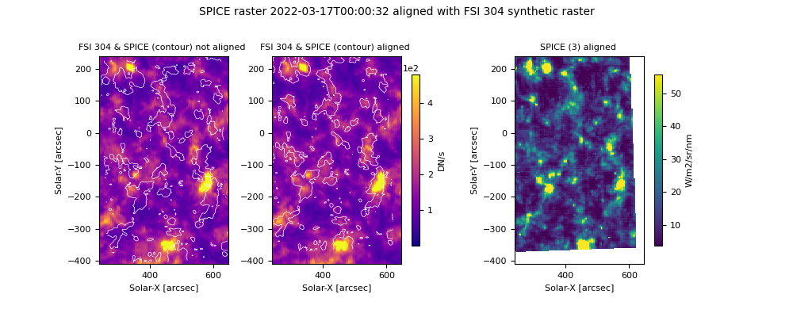

# SPICE_Alignement

## description :

Alignement functions for Imagers, SPICE or EIS with imagers or synthetic rasters of imagers. 
Co-align image using the Pearson's coefficient or the residus method. The alignement can be performed with both images: 

- in helioprojective coordinates (Alignement)
- in carrington coordinates
- by slicing over the large FOV image pixels, complitely neglecting the headers

The code also allows to create synthetic rasters of SPICE or EIS image, using a list of imager paths.

## installation
either use pip install + git in your virtual environment :

```shell
pip install git+https://github.com/adolliou/SPICE_Alignement
```
to create a virtual environement do in your local python folder :
```shell
python -m venv env
source env/bin/activate # write "deactivate" in shell to go out of your virtual environement. 
```
or locally while in the local folder:

```shell
cd path/to/git/repo
pip install .
```


## Usage

See the test folder for multiple examples.
We show here a typical example to align SPICE data with a synthetic raster created from FSI 304 files. 

### Creation of a SPICE synthetic raster 
First of all, we need to create a synthetic raster of the SPICE raster using the reference SPICE raster and a list of the imager fits files. 
```python
from SPICE_alignment.synras.map_builder import SPICEComposedMapBuilder
from glob import glob
import astropy.units as u


path_spice = "path/to/spice/l2.fits"
path_to_imager_list = glob("path/to/fsi304/*l2.fits")
window_spice = "Ly-gamma-CIII group (Merged)" # int or str: window in the HDUList used.depends on the alignmenet you want to do. 
window_imager = -1 # same for imagers in imager_list
threshold_time = u.Quantity(30, "s") # maximum threshold time you want
output_L3_fits = "path/to/output/synthetic_raster_folder"

C = SPICEComposedMapBuilder(path_to_spectro=path_spice, list_imager_paths=path_to_imager_list,
                               window_imager=window_imager, window_spectro=window_spice,
                               threshold_time=threshold_time)
C.process(path_output=output_L3_fits)
```
### Align SPICE raster with the created synthetic raster

Create a SPICE pseudo raster by spectrally summing over the chosen HDUList window. Then perform cross-correlations while shifting the headers values.
It returns a cross-correlation matrix that can be used to determine the optimal shift to apply to the header values.
The header values that can be shifted are CRVAL1, CRVAL2, CROTA, CDELT1 (not tested) and CDELT2 (not tested).

```python
import numpy as np
from SPICE_alignment.hdrshift.alignement_spice import AlignmentSpice
from SPICE_alignment.plot.plot import PlotFunctions
from SPICE_alignment.utils.Util import AlignSpiceUtil


path_to_synthetic_raster_fits = "path/to/input/synthetic_raster.fits"
path_spice_input = "path/to/spice/l2.fits"
window_spice_to_align =  "Ly-gamma-CIII group (Merged)"
windows_spice = ["Mg IX 706 - Peak",
            "Ne VIII 770 - Peak",
            "S V 786 / O IV 787 - Peak",
            "Ly-gamma-CIII group (Merged)",
            "LyB- FeX group (Merged)",
            "O VI 1032 - Peak"] # int or str: window in the HDUList used.depends on the alignmenet you want to do. 
window_sr = -1 # same for imagers in imager_list
path_save_figure= "path/to/output/figures/folder"

param_alignement = {
    "lag_crval1": np.arange(-30, -15, 4), # lag crvals in the headers, in arcsec
    "lag_crval2": np.arange(30, 51, 4),  # in arcsec
    "lag_crota": np.array([0]), # in degrees
    "lag_cdelt1": np.array([0]), # in arcsec
    "lag_cdelt2": np.array([0]), # in arcsec
}

parallelism = True

A = AlignmentSpice(large_fov_known_pointing=path_to_synthetic_raster_fits, small_fov_to_correct=path_spice_input,
                         use_tqdm=True,
                   parallelism=parallelism, counts_cpu_max=10,
                        large_fov_window=-1, small_fov_window=window_sr,
                        path_save_figure=path_save_figure,
                   **param_alignement)

corr = A.align_using_helioprojective(method='correlation')
PlotFunctions.plot_correlation(corr, **param_alignement)
AlignSpiceUtil.write_corrected_fits(path_spice_l2_input=path_spice_input, 
                               path_spice_l2_output="path/where/to/save/corrected/fits", corr=corr,
                                    window_spice_list=windows_spice, 
                                    **param_alignement)

PlotFunctions.plot_co_alignment(large_fov_window=-1, large_fov_path=path_to_synthetic_raster_fits,
                                           corr=corr, small_fov_window= window_spice_to_align, 
                                levels_percentile=[80, 90], 
                                           results_folder=None, small_fov_path=path_spice_input, show=True,
                                           **param_alignement)


```
Example of a results for co-alignment between a SPICE C III image and a FSI 304 synthetic raster, obatined with plot_co_alignment :



## credits

- carrington transform: [F. Auchère](https://github.com/frederic-auchere)
- SPICE utils: [G. Pelouze](https://github.com/gpelouze)
- matrix transform: [F. Auchère](https://github.com/frederic-auchere)

## Contact

Author: Antoine Dolliou (antoine.dolliou@universite-paris-saclay.fr)

## Acknowledgment

Please acknowledge Dolliou et al, 2024 (in prep)